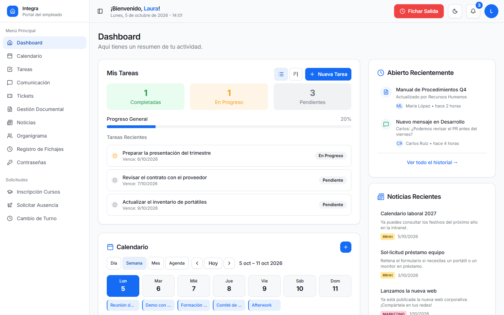

<div align="center">

# 🏢 Integra

**Portal del empleado: fichajes, ausencias, tareas, calendario, tickets y comunicación interna en un solo sitio.**

[](https://github.com/PaulaDolado/Integra/actions/workflows/deploy.yml)
[](https://github.com/PaulaDolado/Integra/actions/workflows/ci.yml)


[**🔗 Sitio en vivo**](https://pauladolado.github.io/Integra/)



</div>

Portal del empleado. Cada persona gestiona su día a día desde un solo sitio: fichajes, ausencias, cambios de turno, tareas, calendario, tickets, tablón de anuncios, chat interno y gestor de contraseñas. RRHH, Dirección, Finanzas y Tecnología tienen además sus propias pantallas de gestión.

🔗 **Sitio en vivo:** https://pauladolado.github.io/Integra

## Índice

- [Stack](#stack)
- [Puesta en marcha](#puesta-en-marcha)
- [Scripts](#scripts)
- [Módulos](#módulos)
- [Permisos por departamento](#permisos-por-departamento)
- [Seguridad](#seguridad)
- [Instalar en el móvil](#instalar-en-el-móvil)
- [Monitorización de errores](#monitorización-de-errores)
- [Base de datos](#base-de-datos)
- [Avisos en Teams y Google Chat](#avisos-en-teams-y-google-chat)
- [Avisos en la app](#avisos-en-la-app)
- [Tests](#tests)
- [Accesibilidad](#accesibilidad)
- [Tests end-to-end](#tests-end-to-end)
- [Estructura del proyecto](#estructura-del-proyecto)
- [Añadir una página](#añadir-una-página)
- [Despliegue](#despliegue)

## Stack

| Capa | Tecnología |
| --- | --- |
| Lenguaje | TypeScript 5 |
| Interfaz | React 19 |
| Build y servidor de desarrollo | Vite 8 (empaquetador Rolldown, plugin React) |
| Rutas | React Router 8 (modo declarativo, paquete `react-router`) |
| Estilos | Tailwind CSS 4 (plugin de Vite, tema en `src/index.css`), fuente Inter Variable, tema claro y oscuro |
| Componentes | shadcn/ui sobre Radix UI, iconos Lucide |
| Datos del servidor | Supabase JS y TanStack Query 5 |
| Fechas | date-fns 4 y react-day-picker 10 |
| Backend | Supabase: PostgreSQL, Auth (con doble factor TOTP), Storage, Realtime y Row Level Security |
| Tests | Vitest 5, Testing Library y jsdom; Playwright para los tests end-to-end |
| Calidad de código | ESLint 10, typescript-eslint y las reglas del React Compiler (eslint-plugin-react-hooks 7) |

## Puesta en marcha

Requisitos:

- Node.js 22.22 o superior (o 24.15 o superior), y npm. Con versiones anteriores los tests no arrancan.
- Acceso al proyecto de Supabase.
- Opcional: [Supabase CLI](https://supabase.com/docs/guides/cli) para aplicar las migraciones desde la terminal.

```sh
git clone https://github.com/PaulaDolado/Integra.git
cd Integra
npm install
cp .env.example .env   # y rellena los valores de Supabase
npm run dev
```

La aplicación arranca en http://localhost:8080.

### Variables de entorno

Copia `.env.example` a `.env` y rellénalo con los datos de **Project Settings → API** de Supabase:

```
VITE_SUPABASE_PROJECT_ID=
VITE_SUPABASE_URL=
VITE_SUPABASE_PUBLISHABLE_KEY=
```

- El `.env` no se sube a git.
- La clave publicable es pública por diseño: lo que protege los datos son las políticas RLS de la base de datos.
- **No pongas nunca la clave `secret` ni la `service_role` en el frontend ni en `.env`.**
- `VITE_SENTRY_DSN` es opcional y normalmente se deja vacío: ver [Monitorización de errores](#monitorización-de-errores).
- Si cambias el `.env`, reinicia `npm run dev` para que Vite cargue los valores nuevos.

### Usuario demo

1. En Supabase, entra en **Authentication → Users → Add user**, usa el email `demo@integra.local` y marca **Auto Confirm User**.
2. Ejecuta `supabase/seed-demo.sql` en el **SQL Editor** para crear su perfil de empleado.

El usuario demo es administrador (`empleados.es_admin`), así que ve todas las pantallas de gestión.

## Scripts

| Comando | Descripción |
| --- | --- |
| `npm run dev` | Servidor de desarrollo con recarga en caliente |
| `npm run build` | Build de producción en `dist/` (incluye la CSP) |
| `npm run build:dev` | Build en modo desarrollo |
| `npm run preview` | Sirve el build de `dist/` para probarlo |
| `npm test` | Ejecuta los tests una vez |
| `npm run test:watch` | Ejecuta los tests cada vez que se guarda un archivo |
| `npm run test:e2e` | Tests end-to-end con Playwright, contra el proyecto de Supabase de pruebas |
| `npm run test:humo` | Prueba de humo de solo lectura contra la web publicada (necesita `HUMO_URL`) |
| `npm run lint` | Ejecuta ESLint |
| `npm run typecheck` | Comprueba los tipos de TypeScript (modo estricto) |
| `npm run iconos` | Vuelve a generar los iconos PNG de la app instalable a partir de `public/favicon.svg` |

## Módulos

Todas las rutas requieren sesión, salvo `/login` y `/reset-password`. Si el usuario tiene activado el doble factor, también hace falta haberlo verificado.

### Para toda la plantilla

| Ruta | Módulo |
| --- | --- |
| `/login`, `/reset-password` | Inicio de sesión con email o Google, doble factor y recuperación de contraseña |
| `/dashboard` | Panel con widgets de calendario, tareas, tickets y noticias |
| `/calendario` | Eventos con vista diaria, semanal, mensual y anual |
| `/tareas` | Tablero kanban con detalle de cada tarea, propiedades personalizadas e imágenes, en tiempo real |
| `/comunicacion` | Chat interno con indicador de presencia |
| `/tickets`, `/tickets/:id` | Tickets al estilo GLPI: incidencias y peticiones, prioridades, respuestas, soluciones e imágenes adjuntas |
| `/noticias` | Tablón de corcho con los comunicados y formularios (con enlace para rellenarlos) de RRHH y de Marketing; cada nota dura 1, 2 o 3 meses o queda fija |
| `/organigrama` | Quién es quién por departamento. Solo muestra el nombre y el puesto, sin datos personales |
| `/fichajes` | Fichaje de entrada y salida, y el historial propio |
| `/vacaciones` | Solicitar ausencia: tipo, motivo y justificante |
| `/cambio-turno` | Solicitar un cambio de turno, con o sin intercambio con un compañero |
| `/contrasenas` | Gestor de contraseñas personal: bóveda cifrada con una contraseña maestra, generador, favoritas y aviso de contraseñas débiles o repetidas |
| `/perfil`, `/configuracion` | Perfil, inicio de sesión (doble factor y Google), confidencialidad e información de pago |
| `/documentos`, `/cursos` | En desarrollo |

### Pantallas de gestión

Solo aparecen en el menú lateral si el departamento del usuario tiene el permiso correspondiente.

| Ruta | Módulo | Permiso |
| --- | --- | --- |
| `/bandeja-ausencias` | Aprobar o rechazar ausencias | `ausencias.aprobar` |
| `/bandeja-turnos` | Aprobar o rechazar cambios de turno | `turnos.aprobar` |
| `/gestion-empleados` | Altas, cargo, departamento y estado de los empleados | `empleados.gestionar` |
| `/gestion-tickets` | Todos los tickets: asignar, cambiar el estado y resolver | `tickets.gestionar` |
| `/gestion-fichajes` | Fichajes de la plantilla y exportación a CSV. Las correcciones manuales exigen justificación y quedan auditadas | `fichajes.ver_todos` y `fichajes.editar` |
| `/gestion-contactos` | Contactos de emergencia de la plantilla, en solo lectura | `contactos_emergencia.ver` |
| `/gestion-pagos` | Datos de pago para la nómina. El IBAN sale enmascarado, y cada consulta completa o exportación queda registrada | `datos_pago.ver` |

## Permisos por departamento

Los departamentos funcionan como roles. Qué permite cada permiso se define en `public.permisos`, y qué departamento lo tiene en `public.departamento_permisos`. Se cambian desde el panel de Supabase, sin tocar código.

| Departamento | Permisos |
| --- | --- |
| Recursos Humanos | `comunicados.rrhh`, `ausencias.aprobar`, `turnos.aprobar`, `empleados.gestionar`, `fichajes.ver_todos`, `fichajes.editar`, `contactos_emergencia.ver` |
| Dirección General | `ausencias.aprobar`, `turnos.aprobar`, `fichajes.ver_todos`, `fichajes.editar` |
| Finanzas y Contabilidad | `datos_pago.ver` |
| Marketing, Comunicación | `comunicados.marketing` |
| Tecnología | `tickets.gestionar` |

Un empleado con `es_admin = true` tiene todos los permisos.

- En el frontend, `usePermisos()` (`src/hooks/usePermisos.ts`) devuelve `tiene("permiso")`. Solo sirve para mostrar u ocultar opciones.
- Quien decide de verdad es la base de datos. Las políticas RLS y las funciones del servidor vuelven a comprobar cada permiso con `public.tengo_permiso(codigo)`.

## Seguridad

- **Row Level Security** en todas las tablas. Cada empleado solo lee y modifica sus propios datos, salvo lo que le conceda su departamento.
- **Datos sensibles a través de funciones del servidor.** El organigrama, los contactos de emergencia y los datos de pago se leen con funciones `SECURITY DEFINER`, que devuelven solo los campos necesarios:
  - El organigrama nunca envía el teléfono, el correo ni la dirección.
  - El IBAN llega enmascarado. Para verlo entero hay que pedirlo con `ver_iban()`, que registra quién lo consultó en `accesos_datos_pago`.
- **Gestor de contraseñas cifrado de extremo a extremo.** La bóveda se cifra en el navegador: la contraseña maestra se convierte en una clave AES-GCM de 256 bits con PBKDF2-SHA256 (600.000 iteraciones) y nunca sale del navegador. La base de datos solo guarda texto cifrado, así que ni un administrador ni Supabase pueden leer las contraseñas. Por eso la contraseña maestra no se puede recuperar: si se olvida, solo queda vaciar la bóveda. La bóveda se bloquea al salir de la página y tras 5 minutos sin actividad, y las contraseñas copiadas se borran del portapapeles a los 30 segundos.
- **Doble factor.** Si un usuario lo activa, una política restrictiva en cada tabla (`public.cumple_doble_factor()`) le bloquea los datos hasta que lo verifique.
- **Content Security Policy.** Se añade en el build con un plugin de Vite (`vite.config.ts`) y solo permite cargar código propio y conectar con Supabase (y con Sentry, solo si la [monitorización de errores](#monitorización-de-errores) está activada). El service worker y el manifiesto de la app instalable también tienen que ser propios (`worker-src` y `manifest-src`). En desarrollo no se aplica, porque el HMR de Vite necesita scripts en línea.
- **Sin datos personales en caché.** El service worker de la app instalable solo guarda los archivos del build. Ver [Instalar en el móvil](#instalar-en-el-móvil).
- **Anti-clickjacking.** `src/main.tsx` impide que la app se muestre dentro de un iframe de otra web.
- **Adjuntos.** Solo se admiten imágenes PNG, JPG, WEBP o GIF de hasta 5 MB. Van a buckets privados y se sirven con URLs firmadas de 1 hora.
- **Dependencias.** Dependabot abre cada lunes una PR con las versiones menores y los parches, otra por cada versión mayor y otra para las acciones de GitHub. Los parches de seguridad llegan al momento. Todas pasan por el CI antes de poder fusionarse. `npm audit --omit=dev` debe salir limpio, y el CI lo comprueba en cada PR. Las herramientas que solo se usan al compilar van en `devDependencies`. React Router se actualizó a la versión 7 por los avisos GHSA-wrjc-x8rr-h8h6 y GHSA-337j-9hxr-rhxg. Dependabot no propone versiones mayores de `@types/node`: los tipos siguen a la versión de Node más antigua que admite el proyecto.

## Instalar en el móvil

Integra se puede instalar como una app (PWA), con su icono en la pantalla de inicio y a pantalla completa, sin la barra del navegador. Está pensado sobre todo para fichar. El acceso directo **Fichar** del icono abre directamente `/fichajes`.

- **Android (Chrome):** abre la web, pulsa el menú **⋮** y elige **Instalar aplicación** (o **Añadir a pantalla de inicio**).
- **iPhone y iPad (Safari):** abre la web, pulsa **Compartir** y elige **Añadir a pantalla de inicio**. En iOS solo se puede instalar desde Safari.

La sesión se inicia igual que en el navegador.

**Qué se guarda en el móvil.** El service worker solo guarda la «carcasa» de la app: el JavaScript, el CSS, el HTML, las fuentes y los iconos del build. Así arranca rápido y las rutas funcionan al recargar. **No guarda ningún dato personal.** Las peticiones a Supabase (datos, sesión, archivos y tiempo real) y a cualquier otro dominio van siempre a la red, nunca a la caché. Sin conexión la app se abre, pero no muestra datos ni permite fichar.

**Actualizaciones.** Cuando se publica una versión nueva, aparece el aviso «Hay una versión nueva de Integra» con el botón **Actualizar**. La app no se recarga sola, para no interrumpir un fichaje o un formulario a medias. Con la app abierta, cada hora se comprueba si hay versión nueva.

Detalles técnicos:

- Se genera con `vite-plugin-pwa` (configuración en `vite.config.ts`). El registro y el aviso de versión nueva están en `src/lib/pwa.ts`. Solo se registra en el build de producción, así que ni `npm run dev` ni los tests usan el service worker.
- El manifiesto y el service worker respetan la ruta base (`/Integra/` en GitHub Pages).
- Los iconos (`public/pwa-*.png`, `public/maskable-icon-512x512.png` y `public/apple-touch-icon.png`) salen de `public/favicon.svg`. Si cambia el logotipo, ejecuta `npm run iconos` y sube los PNG.

## Monitorización de errores

Los errores de producción se pueden enviar a [Sentry](https://sentry.io). **Está apagado por defecto**: sin `VITE_SENTRY_DSN`, la app no descarga Sentry ni envía nada a ningún sitio. En desarrollo y en los tests tampoco se activa, aunque haya DSN.

Para activarlo:

1. En Sentry, crea un proyecto de tipo **React**. Si puedes, elige la región de la UE.
2. En **Settings → Security & Privacy** del proyecto, activa **Prevent Storing of IP Addresses** y deja activado **Data Scrubber**.
3. Copia el DSN (**Settings → Client Keys (DSN)**).
4. En GitHub, **Settings → Secrets and variables → Actions**, crea el secreto `VITE_SENTRY_DSN` con ese valor.
5. Vuelve a publicar (push a `main` o **Run workflow**). El build añade el host de Sentry a la CSP y cada error lleva como versión (`release`) el commit publicado.

Para apagarlo, borra el secreto y vuelve a publicar.

Cómo funciona (`src/lib/monitorizacion.ts`):

- Sentry se descarga aparte (`import()`), después del primer render y solo si está activado. Sin DSN, el código inicial apenas crece unos cientos de bytes.
- Se envían los errores al pintar una pantalla (`ErrorBoundary`), los fallos de las consultas y mutaciones de TanStack Query, y los errores y promesas rechazadas que nadie captura. Los avisos al usuario no cambian.

Qué se envía: el mensaje de error, su traza, la URL de la página **sin parámetros ni fragmento**, el idioma y la zona horaria, el origen del error (`interfaz`, `consulta`, `mutacion`…) y el nombre de la consulta (solo el primer elemento de la clave, sin ids).

Qué no se envía:

- Nada del usuario: ni el correo, ni el id, ni la IP (`dataCollection.userInfo: false`; `sendDefaultPii` ya no existe en Sentry 11 y esta es su opción equivalente).
- Ni cabeceras, ni cookies, ni el cuerpo de las peticiones, ni parámetros de URL. Los `details` y `hint` de los errores de Supabase se descartan, porque pueden llevar valores de la fila.
- Ni grabación de sesiones (Session Replay), ni datos de rendimiento, ni sesiones, ni migas de la consola ni de los clics.
- Antes de salir, `beforeSend` repasa el evento entero y sustituye por `[filtrado]` todo lo que parezca un correo, un IBAN, un JWT, un `Bearer` o un parámetro de token o contraseña.

## Base de datos

El esquema está versionado en `supabase/migrations/`. Las migraciones se pueden volver a ejecutar sin romper nada (`IF NOT EXISTS`, `DROP POLICY IF EXISTS`, `ON CONFLICT`).

Para aplicarlas:

- Pega cada archivo nuevo en el **SQL Editor** de Supabase, o
- desde la terminal:

```sh
supabase link --project-ref <project-id>
supabase db push
```

Tablas principales:

| Tabla | Contenido |
| --- | --- |
| `empleados`, `departamentos`, `cargos` | Plantilla y organización |
| `permisos`, `departamento_permisos` | Qué puede hacer cada departamento |
| `fichajes`, `fichaje_correcciones` | Control horario y registro de las correcciones, con su justificación |
| `solicitudes_vacacion` | Ausencias y su aprobación (justificantes en el bucket `justificantes`) |
| `solicitudes_turno` | Cambios e intercambios de turno |
| `tareas`, `proyectos` | Tablero de tareas (imágenes en el bucket `tareas`) |
| `eventos`, `evento_participantes` | Calendario |
| `tickets`, `ticket_seguimientos`, `ticket_adjuntos` | Tickets (imágenes en el bucket `tickets`) |
| `anuncios` | Tablón de anuncios |
| `contactos_emergencia`, `datos_pago`, `accesos_datos_pago` | Datos personales y registro de consultas del IBAN |
| `notificaciones` | Cola de avisos para Teams y Google Chat, con su estado de envío |
| `avisos` | Avisos de la campana de la cabecera, uno por persona |
| `boveda_claves`, `boveda_entradas` | Gestor de contraseñas: parámetros de la clave y entradas, siempre cifradas |

Los tipos de TypeScript están en `src/integrations/supabase/types.ts`. Si cambias el esquema, regenéralos:

```sh
supabase gen types typescript --project-id <project-id> > src/integrations/supabase/types.ts
```

## Avisos en Teams y Google Chat

Integra avisa en Teams o Google Chat de lo que pasa en la app. Es en un solo sentido: lo que se escriba en Teams o Google Chat no llega a Integra.

| Evento | A quién | Variable del webhook |
| --- | --- | --- |
| Nueva solicitud de ausencia | Canal de RRHH | `WEBHOOK_RRHH` |
| Ausencia aprobada o rechazada | Quien la pidió | `WEBHOOK_PERSONAL` |
| Propuesta de intercambio de turno | El compañero | `WEBHOOK_PERSONAL` |
| Cambio de turno pendiente de aprobar | Canal de RRHH | `WEBHOOK_RRHH` |
| Cambio de turno aprobado o rechazado | Quien lo pidió | `WEBHOOK_PERSONAL` |
| Ticket nuevo | Canal de Tecnología | `WEBHOOK_TECNOLOGIA` |
| Ticket asignado | El técnico | `WEBHOOK_PERSONAL` |
| Ticket resuelto | Quien lo abrió | `WEBHOOK_PERSONAL` |
| Comunicado nuevo en el tablón | Canal general | `WEBHOOK_GENERAL` |

Cómo funciona:

- Unos triggers de la base de datos dejan cada aviso en la tabla `notificaciones`.
- La Edge Function `notificar` (`supabase/functions/notificar/`) los envía a los webhooks. Por la URL sabe si cada uno es de Teams o de Google Chat.
- Si un envío falla, `pg_cron` lo reintenta cada 5 minutos, hasta 5 veces. Los avisos enviados se borran a los 90 días.
- Si un destino no tiene webhook, el aviso queda como `omitida`. Se pueden activar solo los canales que interesen.
- Nadie recibe aviso de lo que ha hecho él mismo.
- Un fallo de los avisos nunca impide crear el ticket, aprobar la ausencia, etc.
- No se envían datos sensibles: ni el tipo ni el motivo de una ausencia, que pueden ser datos de salud.

### Configuración

1. **Webhooks de cada canal.**
   - **Teams:** en el canal, **⋯ → Workflows → «Publicar en un canal cuando se reciba una solicitud de webhook»**, y copia la URL. Los «conectores de Office 365» se están retirando: usa Workflows.
   - **Google Chat:** en el espacio, **Aplicaciones e integraciones → Webhooks → Añadir**, y copia la URL.
2. **Mensajes directos (solo Teams).** Un webhook de Google Chat publica en un espacio, pero no puede escribir a una persona. Con Google Chat, los avisos personales quedan como `omitida`. En Teams, crea un flujo en Power Automate:
   - Desencadenador: **Cuando se recibe una solicitud de webhook de Teams**.
   - Acción: **Publicar tarjeta en un chat o canal**, con «Publicar como: Flow bot», «Publicar en: Chat con el bot de Flow».
   - Destinatario: `@{triggerBody()?['destinatario']}` (el correo del empleado en Integra).
   - Tarjeta adaptable: `@{triggerBody()?['attachments'][0]['content']}`.

   Su URL es `WEBHOOK_PERSONAL`.
3. **Secretos de la función y despliegue.** Inventa un secreto largo, por ejemplo con `openssl rand -hex 32`, y ejecuta:

   ```sh
   supabase secrets set NOTIFICACIONES_SECRETO=<secreto> APP_URL=https://<usuario>.github.io/<repositorio>/ \
     WEBHOOK_RRHH=<url> WEBHOOK_TECNOLOGIA=<url> WEBHOOK_GENERAL=<url> WEBHOOK_PERSONAL=<url>
   supabase functions deploy notificar
   ```

4. **Aplica la migración** `20261002120000_notificaciones_chat.sql`. Activa `pg_net` y `pg_cron`.
5. **Conecta la base de datos con la función.** En el **SQL Editor**, con el mismo secreto:

   ```sql
   SELECT vault.create_secret('https://<project-ref>.supabase.co/functions/v1/notificar', 'notificaciones_url');
   SELECT vault.create_secret('<secreto>', 'notificaciones_secreto');
   ```

   Hasta este paso, los avisos se acumulan en la cola sin enviarse.

Para probar un canal sin esperar a que pase nada:

```sh
curl -X POST https://<project-ref>.supabase.co/functions/v1/notificar \
  -H "x-integra-secreto: <secreto>" -d '{"prueba": "rrhh"}'
```

Para ver qué se ha enviado y qué ha fallado, consulta la tabla `notificaciones` en el panel de Supabase (columnas `estado` y `error`).

## Avisos en la app

La campana de la cabecera muestra los últimos 30 avisos de cada persona y cuántos tiene sin leer. Los avisos nuevos llegan al momento por Realtime y, con la app abierta, también salen en un toast. Al pulsar uno se marca como leído y se abre la pantalla correspondiente.

| Evento | A quién |
| --- | --- |
| Ausencia aprobada o rechazada | Quien la pidió |
| Propuesta de intercambio de turno, o su cancelación | El compañero |
| El compañero acepta o rechaza el intercambio | Quien lo pidió |
| Cambio de turno aprobado o rechazado | Quien lo pidió y, si es un intercambio, el compañero |
| Respuesta o solución en un ticket | Quien lo abrió, si escribe otra persona |
| Respuesta o solución en un ticket asignado | El técnico asignado, si escribe otra persona |
| Ticket asignado | El técnico |
| Cambio de estado de un ticket (en curso, en espera, cerrado…) | Quien lo abrió |
| El solicitante aprueba la solución | El técnico asignado |
| Comunicado nuevo en el tablón | Toda la plantilla activa con acceso a la app, salvo quien lo publica |

Cómo funciona:

- Unos triggers de la base de datos crean los avisos en la tabla `avisos`. Son independientes de los de Teams y Google Chat: no hace falta configurar webhooks.
- Cada persona solo ve sus avisos y solo puede marcarlos como leídos (`marcar_avisos_leidos`). Nadie puede crearlos ni borrarlos desde la app.
- Nadie recibe aviso de lo que ha hecho él mismo, ni quien está de baja.
- Un fallo de los avisos nunca impide aprobar la ausencia, responder el ticket, etc.
- Como en Teams, no se incluyen ni el tipo ni el motivo de una ausencia.
- Un comunicado crea una fila por persona. Con unos cientos de empleados no es un problema.

Para activarlo, **aplica la migración** `20261006100000_avisos.sql` (después de `20261002120000_notificaciones_chat.sql`, de la que usa algunas funciones). También añade la tabla a Realtime.

Limpieza: `pg_cron` ejecuta `limpiar_avisos()` cada noche. Borra los avisos leídos hace más de 90 días y cualquier aviso de más de un año. Si `pg_cron` no está activado, la migración no falla, pero hay que ejecutar `SELECT public.limpiar_avisos();` a mano de vez en cuando.

## Tests

```sh
npm test
```

Los tests usan Vitest con jsdom y Testing Library. Están junto al código que prueban (`*.test.ts`, `*.test.tsx`):

| Test | Qué comprueba |
| --- | --- |
| `components/contrasenas/cripto.test.ts` | La bóveda solo se abre con la contraseña maestra correcta, y lo cifrado no se puede leer ni manipular |
| `components/contrasenas/contrasenas.test.ts` | Generador, fuerza de las contraseñas, débiles y repetidas, y que nunca se abren enlaces `javascript:` |
| `components/fichajes/calculo.test.ts` | Horas trabajadas, tramos, incidencias, fichajes anulados y corregidos, y el formato del CSV para Excel |
| `components/tickets/adjuntos.test.ts` | Tipos, tamaño y número máximo de imágenes adjuntas |
| `components/ErrorBoundary.test.tsx` | Si una pantalla falla, muestra un aviso en vez de dejarla en blanco; tras publicar una versión nueva, recarga una sola vez. El error va a la monitorización |
| `components/ProtectedRoute.test.tsx` | Redirige al login sin sesión o sin el doble factor verificado |
| `components/layout/AppSidebar.test.tsx` | El menú solo muestra las pantallas de gestión que concede el departamento, y marca el apartado activo |
| `hooks/usePermisos.test.tsx` | Carga los permisos una vez por usuario y no concede nada si la consulta falla |
| `hooks/useInvalidarEnCambios.test.tsx` | Los cambios recibidos por Realtime invalidan las consultas indicadas, sin suscribirse de nuevo en cada render |
| `contexts/AuthContext.test.tsx` | Al cerrar sesión se vacía la caché de datos |
| `lib/monitorizacion.test.ts` | Sin DSN no se descarga Sentry ni se envía nada; con DSN, no van ni el usuario, ni cabeceras, ni cuerpos, y se borran correos, IBAN, tokens y parámetros de URL |
| `lib/tema.test.ts` | El modo oscuro se recuerda y, si no hay preferencia guardada, sigue la del sistema |
| `pages/Organigrama.test.tsx` | Solo usa la función `organigrama`, nunca la tabla `empleados`, y no muestra correos ni teléfonos |
| `pages/GestionDatosPago.test.tsx` | IBAN enmascarado; el completo solo se pide al pulsar «Mostrar» |
| `supabase/functions/notificar/mensajes.test.ts` | Cada aviso va al webhook que le toca, con el formato de Teams o de Google Chat, y el texto de los usuarios no puede mencionar a todo un espacio |
| `pages/Contrasenas.test.tsx` | Al servidor nunca llegan la contraseña maestra ni las entradas en claro; bloquear oculta las contraseñas |
| `components/layout/AppLayout.test.tsx` | El enlace «Saltar al contenido» es lo primero que se enfoca y lleva al `<main>` |

Los tests nunca se conectan a Supabase: cada uno simula el cliente con `vi.mock` (hay un ayudante en `src/test/supabase-mock.ts`). Las políticas RLS no se prueban aquí, porque necesitan una base de datos real.

### Integración continua

- **Pull requests:** [`.github/workflows/ci.yml`](.github/workflows/ci.yml) ejecuta el lint, los tipos, los tests, el build y `npm audit --omit=dev`.
- **Despliegue:** el workflow de despliegue ejecuta el lint, los tipos y los tests antes del build. Si algo falla, no se publica. Después de publicar, ejecuta la prueba de humo.

## Accesibilidad

Hay dos comprobaciones automáticas, y las dos se ejecutan con `npm run lint` y `npm test` (también en la integración continua):

- **Lint ([`eslint-plugin-jsx-a11y`](https://github.com/jsx-eslint/eslint-plugin-jsx-a11y)).** Las reglas recomendadas revisan el JSX: imágenes sin `alt`, etiquetas sin control asociado, roles y atributos ARIA no válidos, o elementos con `onClick` que no se pueden usar con el teclado. Los componentes `Button`, `Input`, `Textarea` y `Label` de `ui/` se tratan como el elemento HTML que pintan. La única regla desactivada es `no-autofocus` (el motivo está en `eslint.config.js`). El plugin aún no declara compatibilidad con ESLint 10, pero funciona: `package.json` lo instala con un `overrides`.
- **axe en los tests ([`axe-core`](https://github.com/dequelabs/axe-core)).** Cada pantalla principal tiene un test `no tiene problemas de accesibilidad` que la pinta con sus datos simulados (y, cuando los tiene, con sus diálogos abiertos) y le pasa axe con `expectSinViolaciones()` de [`src/test/accesibilidad.ts`](src/test/accesibilidad.ts). Si algo falla, el error dice qué regla, en qué elemento y cómo arreglarlo.

```tsx
import { expectSinViolaciones } from "@/test/accesibilidad";

it("no tiene problemas de accesibilidad", async () => {
  renderConQuery(<MiPantalla />);
  await screen.findByText("Algo que ya ha cargado");
  await expectSinViolaciones();
});
```

Lo que jsdom no puede comprobar, y hay que revisar a mano en un navegador:

- **Contraste de color.** jsdom no aplica los estilos de Tailwind, así que la regla `color-contrast` está desactivada en los tests. Conviene revisarlo con las herramientas del navegador (o la extensión de axe), en modo claro y oscuro.
- **Landmarks.** Los tests de cada pantalla la pintan sin el layout, así que la regla `region` solo se comprueba en el test de `AppLayout` y en el login.
- **Orden y visibilidad del foco**, y cómo lo anuncia un lector de pantalla de verdad (NVDA, VoiceOver).

Al crear una pantalla nueva: un `<h1>` con su título (los `CardTitle` son `<h2>`), nombre accesible en los botones que solo llevan un icono (`aria-label` en español), una etiqueta para cada campo (con `<Label htmlFor>` o `aria-label`; el `placeholder` no cuenta) y botones o enlaces de verdad en lo que se pulsa. El layout ya incluye el enlace «Saltar al contenido» y el `<main>`.

## Tests end-to-end

Los tests de `e2e/` usan Playwright y prueban la app entera: el build de producción con su CSP, el inicio de sesión, la seguridad de la base de datos y el tiempo real entre dos personas.

| Test | Qué comprueba |
| --- | --- |
| `sin-sesion.spec.ts` | Las páginas privadas mandan al login, la 404, la CSP del build (y que no bloquea nada) y que una contraseña incorrecta no entra |
| `empleado.spec.ts` | Fichar entrada y salida, crear un ticket, que no vea las pantallas de gestión ni los datos personales del organigrama, y cerrar sesión |
| `entre-personas.spec.ts` | Un empleado pide una ausencia, RRHH la ve llegar sin recargar y la aprueba, y el empleado ve el cambio al momento |

**Nunca se ejecutan contra producción.** Crean y borran fichajes, tickets y ausencias, así que usan un **proyecto de Supabase aparte, solo para tests**. Si la URL coincide con la de producción, los tests se niegan a arrancar.

Cada ejecución:

1. Crea o reutiliza dos personas de prueba, `e2e-empleado@integra.test` (Operaciones) y `e2e-rrhh@integra.test` (Recursos Humanos), con una contraseña aleatoria nueva que no se guarda en ningún sitio fijo.
2. Ejecuta los tests.
3. Borra lo que han creado.

Las tareas de preparar y limpiar usan la clave `service_role` del proyecto de pruebas. Esa clave nunca llega al navegador.

### Configurar el proyecto de pruebas

1. **Aplica las migraciones al proyecto de pruebas**, desde la terminal. Te pedirá iniciar sesión en Supabase y la contraseña de la base de datos de ese proyecto:

   ```sh
   npx supabase login
   npx supabase link --project-ref <project-ref-de-pruebas>
   npx supabase db push
   ```

   No configures los webhooks de Teams ni de Google Chat en este proyecto. Así los avisos se quedan en la cola y no llegan a ningún canal.

2. **En GitHub** (Settings → Secrets and variables → Actions):
   - Variables `E2E_SUPABASE_URL` y `E2E_SUPABASE_PUBLISHABLE_KEY`, del proyecto de pruebas.
   - Secreto `E2E_SUPABASE_SERVICE_ROLE_KEY`, la clave `secret` del proyecto de pruebas (**Project Settings → API Keys**). Nunca la de producción.

   El workflow [`e2e.yml`](.github/workflows/e2e.yml) se ejecuta en cada PR. Si no está la variable `E2E_SUPABASE_URL`, se salta.

3. **En local**, crea `.env.e2e.local` (no se sube a git) con las tres claves y ejecuta los tests:

   ```
   E2E_SUPABASE_URL=
   E2E_SUPABASE_PUBLISHABLE_KEY=
   E2E_SUPABASE_SERVICE_ROLE_KEY=
   ```

   ```sh
   npx playwright install chromium   # solo la primera vez
   npm run test:e2e
   ```

   Sin `E2E_SUPABASE_SERVICE_ROLE_KEY` solo funcionan los tests sin sesión: `npx playwright test --project=sin-sesion`.

### Prueba de humo en producción

Después de cada despliegue, el workflow de publicación ejecuta `sin-sesion.spec.ts` contra la web recién publicada y el Supabase de producción (`playwright.humo.config.ts`). Es **solo de lectura**: no inicia sesión, no crea cuentas, no escribe datos y no usa la clave `service_role`. Se salta el test de la contraseña incorrecta, porque intentaría iniciar sesión en producción. Detecta una publicación rota o una CSP que bloquee algo.

Para lanzarla a mano:

```sh
HUMO_URL=https://<usuario>.github.io/<repositorio>/ VITE_SUPABASE_URL=<url-de-producción> npm run test:humo
```

## Estructura del proyecto

```
src/
├── App.tsx                  # Rutas
├── main.tsx                 # Punto de entrada: tema, anti-iframe, render y service worker
├── index.css                # Tokens de diseño (colores, sombras, tema oscuro)
├── components/
│   ├── ProtectedRoute.tsx   # Exige sesión (y doble factor si está activado)
│   ├── layout/              # Layout, menú lateral y cabecera
│   ├── dashboard/           # Widgets del panel principal
│   ├── ausencias/ chat/ configuracion/ contrasenas/ fichajes/ noticias/ tareas/ tickets/ turnos/
│   └── ui/                  # Componentes de shadcn/ui
├── contexts/                # Sesión (AuthContext) y presencia del chat
├── hooks/                   # Permisos, perfil, fichaje actual, toasts…
├── integrations/supabase/   # Cliente y tipos
├── lib/                     # Utilidades, rutas base, tema, app instalable, cliente de TanStack Query y monitorización de errores
├── pages/                   # Una página por ruta
└── test/                    # Configuración y ayudantes de los tests
scripts/
└── generar-iconos.mjs       # Iconos PNG de la app instalable (npm run iconos)
supabase/
├── functions/notificar/     # Edge Function de los avisos a Teams y Google Chat
├── migrations/              # Esquema, políticas RLS y funciones
└── seed-demo.sql            # Perfil del usuario demo
```

El alias `@` apunta a `src/`, por ejemplo `import { supabase } from "@/integrations/supabase/client"`.

## Añadir una página

1. Crea el componente en `src/pages/`.
2. En `src/App.tsx`, impórtala con `lazy(() => import("./pages/MiPagina"))` y añade su `<Route>` dentro de la ruta `ZonaPrivada`, que ya exige sesión y pone el menú y la cabecera. Cada página se descarga solo cuando se visita, así que necesita un `export default`.
3. Añade el enlace en `src/components/layout/AppSidebar.tsx`. Si es una pantalla de gestión, va en `managementItems` con su `permiso`.
4. Si necesita un permiso nuevo:
   - añádelo en una migración a `permisos` y a `departamento_permisos`;
   - añádelo al tipo `Permiso` de `src/hooks/usePermisos.ts`;
   - compruébalo también en las políticas RLS.
5. Importa las rutas desde `react-router`, no desde `react-router-dom`.

### Cargar datos

Los datos del servidor se cargan con TanStack Query, no con `useState` y `useEffect`:

```tsx
const { data: tareas = [], isPending, error } = useQuery({
  queryKey: ["tareas", empleadoId],
  queryFn: async () => comprobar(await supabase.from("tareas").select("*").eq("asignado_a_id", empleadoId!)),
  enabled: !!empleadoId,
});
useAvisarError(error, "No se pudieron cargar las tareas");
useInvalidarEnCambios("tareas-changes", [{ table: "tareas" }], [["tareas"]]);
```

- `comprobar()` (`src/lib/query-client.ts`) convierte el `error` de Supabase en una excepción, para que TanStack Query lo trate como fallo.
- La clave empieza por el dominio en español. Lo que muestra los mismos datos comparte prefijo, y así una sola invalidación actualiza todas las pantallas.
- Si la consulta lleva `enabled` y puede quedar desactivada, usa `isLoading` para el indicador de carga: `isPending` seguiría a `true`.
- Tras guardar algo, llama a `queryClient.invalidateQueries({ queryKey })` en vez de volver a cargar a mano.
- `useInvalidarEnCambios` escucha los cambios de otros usuarios por Realtime e invalida las claves indicadas.
- Para el id o el perfil del empleado de la sesión usa `useMiEmpleadoId()` o `useEmployeeProfile()`, que se piden una sola vez para toda la app.
- La caché se vacía al cerrar sesión. Aun así, nunca guardes en ella datos descifrados de la bóveda ni el IBAN completo.
- En los tests, renderiza con `renderConQuery` (`src/test/render.tsx`).

Para añadir componentes de shadcn/ui:

```sh
npx shadcn@latest add <componente>
```

## Despliegue

`npm run build` genera una web estática en `dist/`. La app usa rutas del lado del cliente, así que el hosting debe servir `index.html` para cualquier ruta. Si no, al recargar una página como `/tareas` aparece un 404.

En Supabase, añade el dominio de producción en **Authentication → URL Configuration** para que funcionen el inicio de sesión, Google y la recuperación de contraseña.

### GitHub Pages

El workflow [`.github/workflows/deploy.yml`](.github/workflows/deploy.yml) se ejecuta en cada push a `main`. Pasa el lint, los tipos y los tests, compila y publica en `https://<usuario>.github.io/<repositorio>/`. También se puede lanzar a mano desde **Actions → Publicar en GitHub Pages → Run workflow**.

Configuración, una sola vez:

1. En GitHub, **Settings → Pages → Build and deployment → Source**: elige **GitHub Actions**.
2. En **Settings → Secrets and variables → Actions**, crea los secretos `VITE_SUPABASE_URL` y `VITE_SUPABASE_PUBLISHABLE_KEY`, con los mismos valores que en `.env`.
3. En Supabase, **Authentication → URL Configuration**:
   - **Site URL**: `https://<usuario>.github.io/<repositorio>/`
   - **Redirect URLs**: añade `https://<usuario>.github.io/<repositorio>/**`

El workflow compila con `BASE_PATH=/<repositorio>/`. Después copia `index.html` a `404.html`, para que al recargar una ruta se cargue la app y no el 404 de GitHub.

GitHub Pages no permite enviar cabeceras HTTP. Por eso la CSP va en una etiqueta `<meta>` que se añade en el build, y la protección contra iframes se hace en `src/main.tsx`.
